# RPA UEMG – Repositório de Publicações Acadêmicas da UEMG

Sistema desktop desenvolvido como Trabalho de Conclusão de Curso em **Engenharia da Computação (UEMG – Divinópolis)**, com o objetivo de gerenciar o repositório institucional de trabalhos acadêmicos (TCCs, projetos de pesquisa, extensão, relatórios, etc.) produzidos na universidade.

O sistema permite **cadastrar, organizar, buscar e acessar** trabalhos acadêmicos, armazenando tanto os metadados quanto o arquivo PDF associado.

---

## 🎯 Objetivo do projeto

- Facilitar o **armazenamento** e a **consulta** de trabalhos acadêmicos da UEMG.
- Oferecer uma interface única para **alunos, professores e funcionários** acessarem o repositório.
- Padronizar o registro de informações como título, autores, orientador, curso, tema, palavras-chave, datas e banca avaliadora.
- Disponibilizar o **download/abertura de PDFs** diretamente a partir do sistema.

---

## 🧱 Tecnologias utilizadas

- **Linguagem:** Java (Java SE, orientação a objetos)
- **Interface gráfica:** Java Swing (NetBeans GUI Builder)
- **Banco de dados:** MySQL
- **Acesso a dados:** JDBC (MySQL Connector/J)
- **Ferramentas de apoio:**  
  - NetBeans  
  - MySQL Workbench  
  - Git / GitHub

---
## 🧭 Fluxo de uso e navegação

A navegação do sistema é organizada por perfis de usuário: **Aluno**, **Professor** e **Funcionário**.  
A partir da **Tela de Login**, cada perfil acessa um conjunto de funcionalidades específicas.

---

### 1. Tela de Login

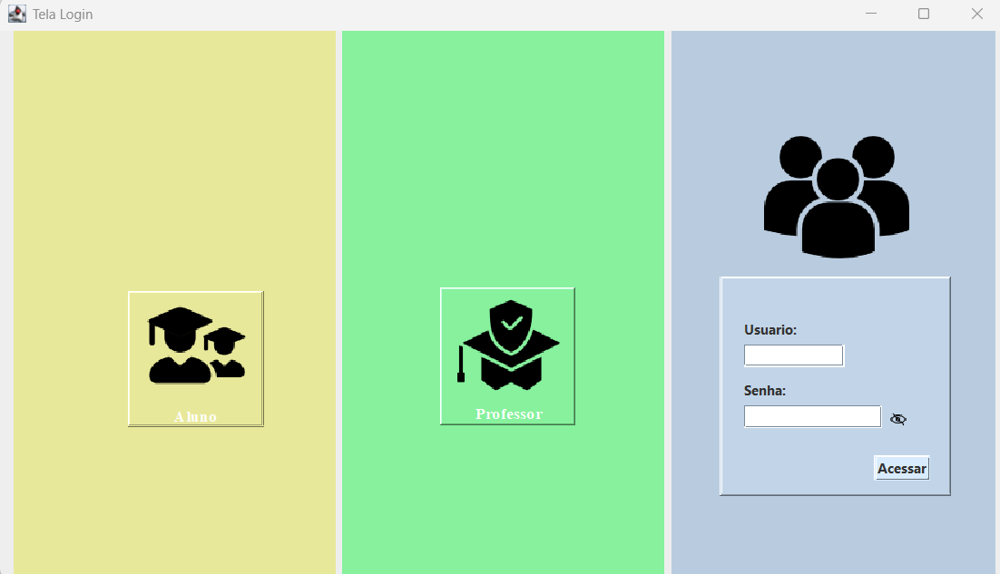

Na tela de login o usuário:

- informa usuário (e-mail) e senha
- caso seja funcionário, pode ir direto para as telas de cadastro de Aluno ou Professor
- acessa o sistema de acordo com o perfil selecionado, sendo redirecionado para a tela inicial correspondente

---

### 2. Telas iniciais por perfil

Após o login, cada perfil é direcionado para uma tela inicial própria, com atalhos para as principais ações.

#### 2.1. Tela Inicial do Aluno

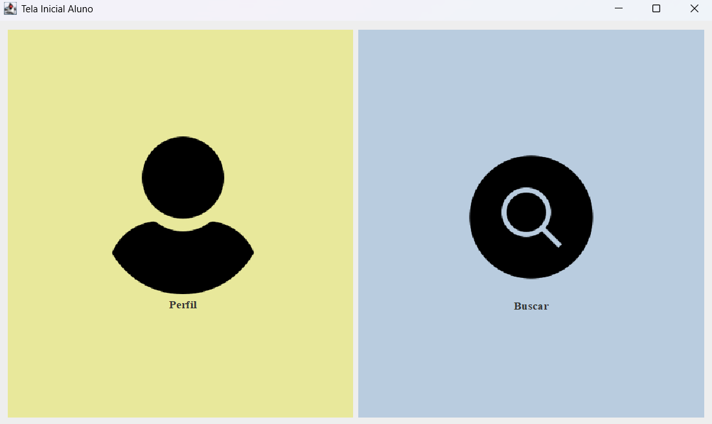

Funcionalidades:

- **Perfil** – acessa os dados do aluno e seus trabalhos vinculados;
- **Buscar** – abre a tela de busca geral de trabalhos acadêmicos.

#### 2.2. Tela Inicial do Professor

Funcionalidades:

- **Perfil** – visualiza os dados do professor e seus trabalhos orientados/submetidos;
- **Adicionar Aluno** – atalho para o cadastro de novos alunos;
- **Buscar** – abre a tela de busca geral de trabalhos;
- **Adicionar Trabalho/Modelo** – atalho para cadastro de novos trabalhos acadêmicos.

#### 2.3. Tela Inicial do Funcionário

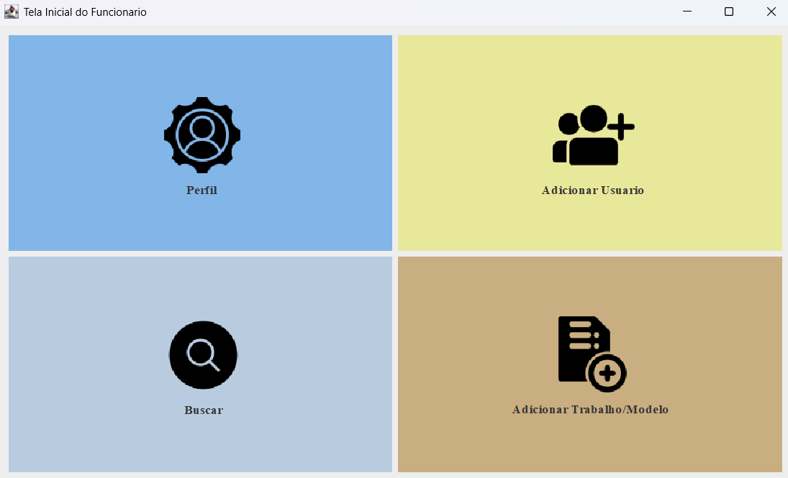

Funcionalidades:

- **Perfil** – visualização dos dados do funcionário;
- **Adicionar Usuário** – abre o menu para escolher o tipo de usuário a ser cadastrado (aluno, professor ou funcionário);
- **Buscar** – abre a tela de busca geral de trabalhos;
- **Adicionar Trabalho/Modelo** – cadastro de novos trabalhos no repositório.

---

### 3. Telas de Perfil e Subperfil

Cada perfil possui uma **tela de perfil**, com dados cadastrais completos, e uma **tela de subperfil**, com foco nos trabalhos vinculados e opção de alteração de dados.

#### 3.1. Perfil do Aluno

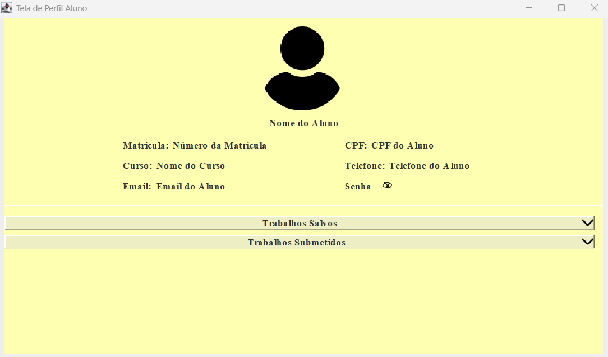

- Exibe: nome, matrícula, curso, CPF, telefone, e-mail e senha.
- Possui seções expansíveis para:
  - **Trabalhos Salvos**;
  - **Trabalhos Submetidos**.

Subperfil do Aluno:

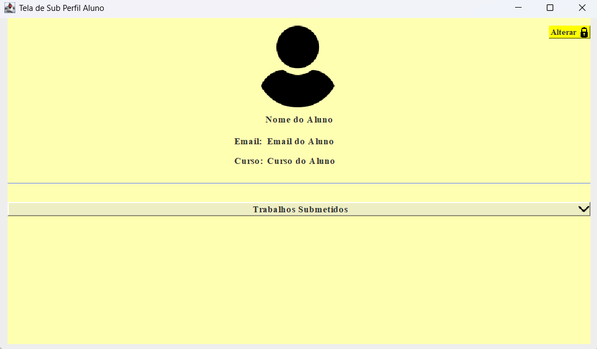

- Mostra dados resumidos do aluno (nome, e-mail e curso);
- Lista **Trabalhos Submetidos**;
- Botão **Alterar** (no canto superior direito) permite ajustes nos dados cadastrais, conforme regras de permissão.

#### 3.2. Perfil do Professor

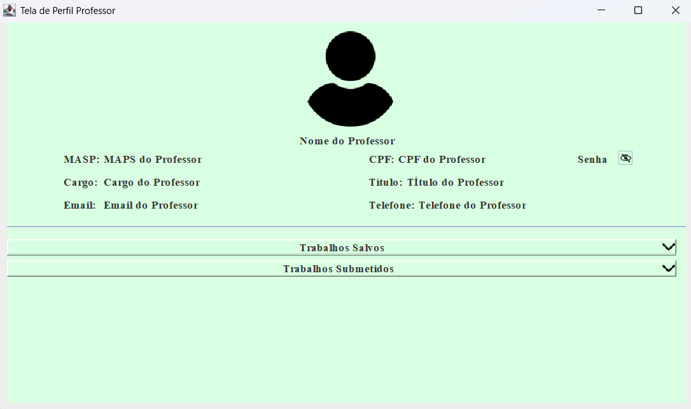

- Exibe: nome, MASP, cargo, título, CPF, e-mail, telefone e senha.
- Seções expansíveis:
  - **Trabalhos Salvos**;
  - **Trabalhos Submetidos**.

Subperfil do Professor:

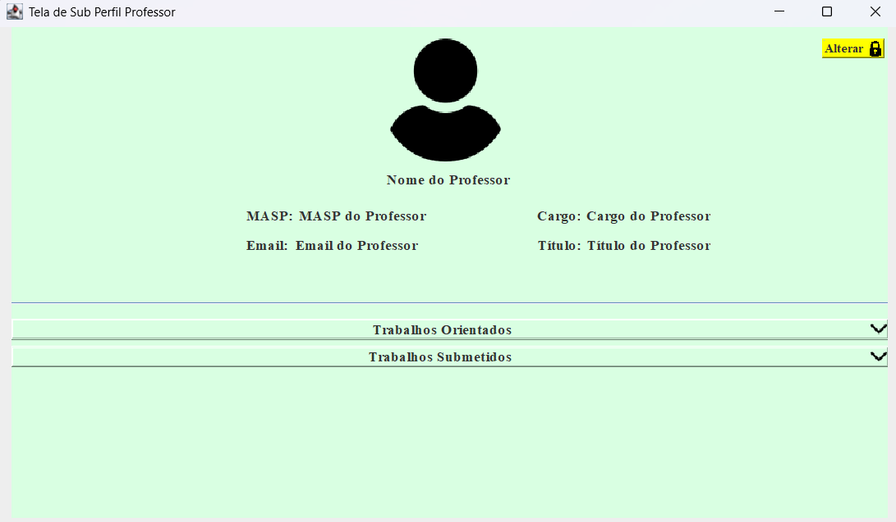

- Destaque para:
  - **Trabalhos Orientados**;
  - **Trabalhos Submetidos**;
- Botão **Alterar** permite atualização dos dados do professor.

#### 3.3. Perfil do Funcionário

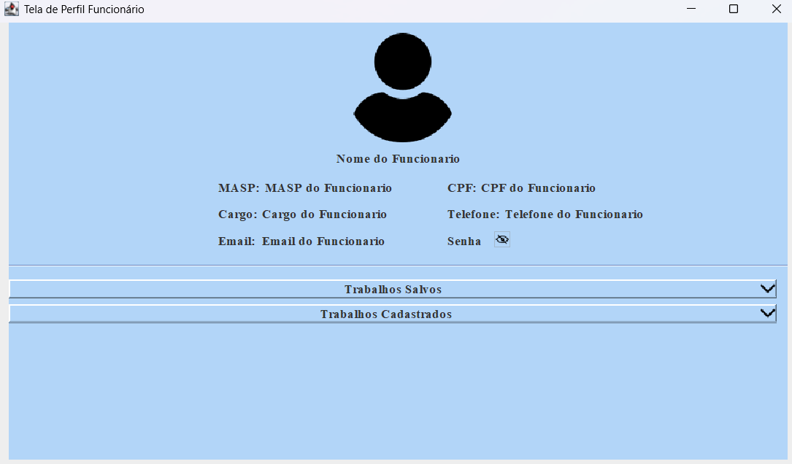

- Exibe: nome, MASP, cargo, CPF, e-mail, telefone e senha.
- Seções expansíveis:
  - **Trabalhos Salvos**;
  - **Trabalhos Cadastrados**.

Subperfil do Funcionário:

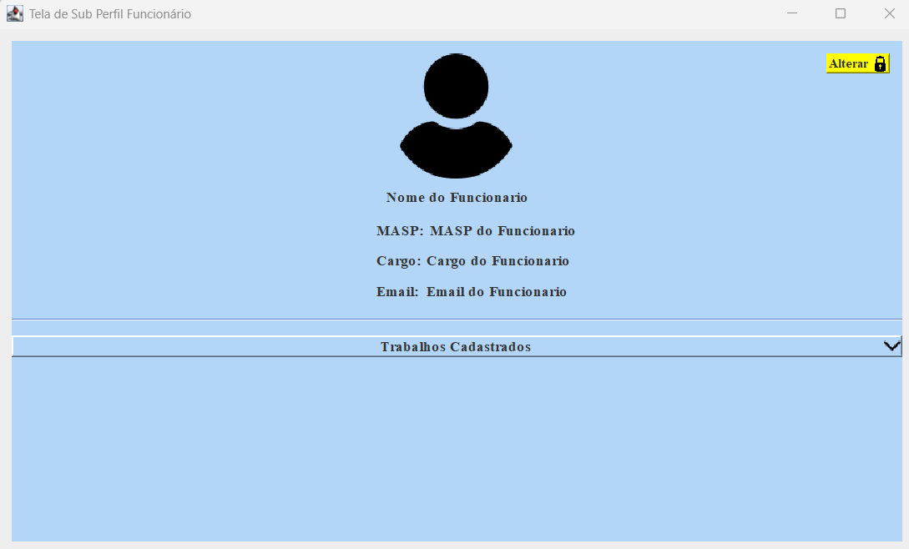

- Foco nos **Trabalhos Cadastrados** por aquele funcionário;
- Botão **Alterar** no topo da tela para edição dos dados cadastrais.

---

### 4. Telas de Cadastro

O sistema possui telas específicas para cadastro, acessíveis principalmente a partir dos perfis de **Professor** e **Funcionário**.

#### 4.1. Seleção do tipo de usuário a cadastrar

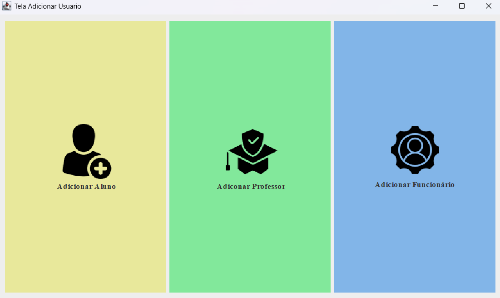

- O funcionário escolhe se deseja:
  - **Adicionar Aluno**,
  - **Adicionar Professor**,
  - **Adicionar Funcionário**.

#### 4.2. Cadastro de Aluno

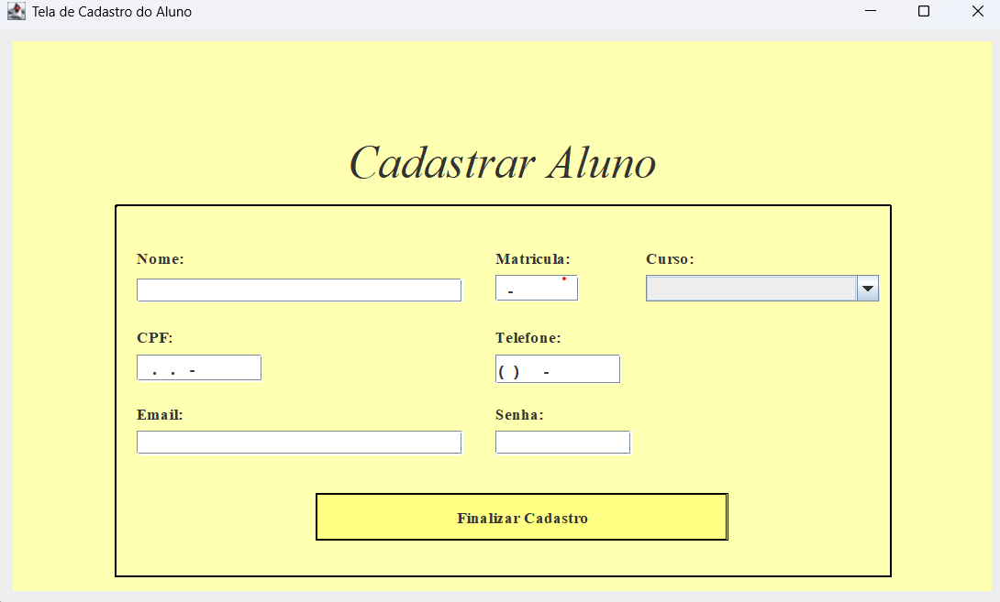

- Campos para: nome, matrícula, curso, CPF, e-mail, telefone e senha;
- Botão **Finalizar Cadastro** grava o novo aluno no banco de dados.

#### 4.3. Cadastro de Professor

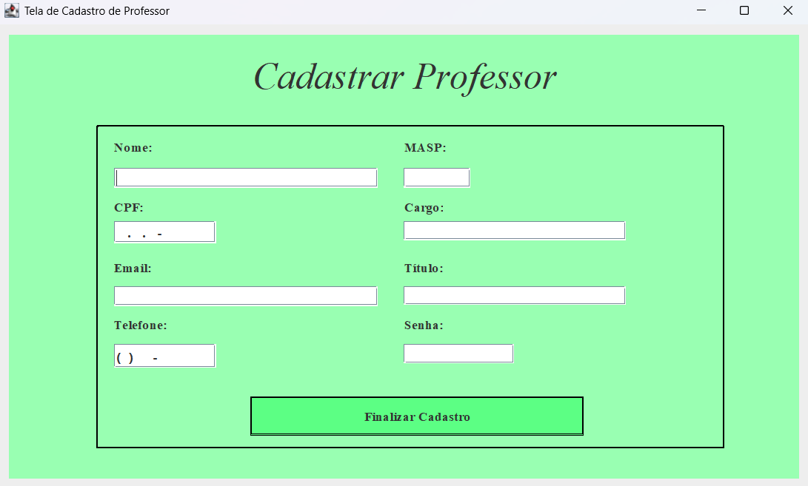

- Campos para: nome, ID/MASP do professor, CPF, cargo, título, e-mail, telefone e senha;
- Botão **Finalizar Cadastro** registra o professor no sistema.

#### 4.4. Cadastro de Funcionário

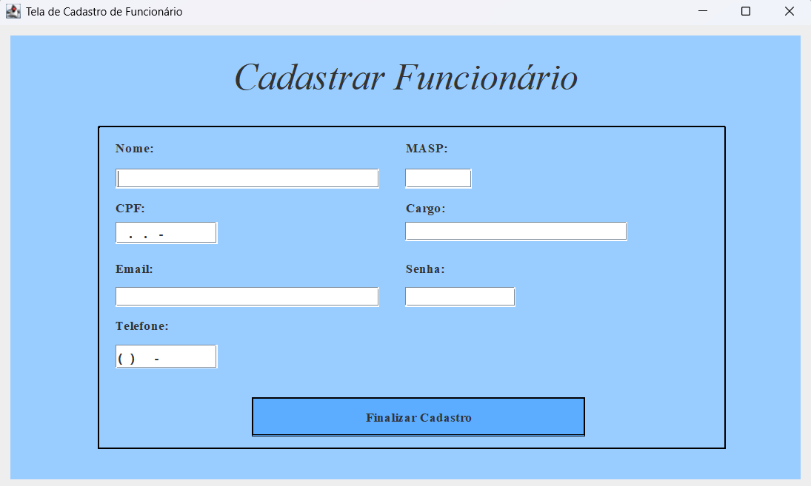

- Campos para: nome, MASP, cargo, CPF, e-mail, telefone e senha;
- Botão **Finalizar Cadastro** grava o funcionário no repositório.

#### 4.5. Cadastro de Trabalho Acadêmico

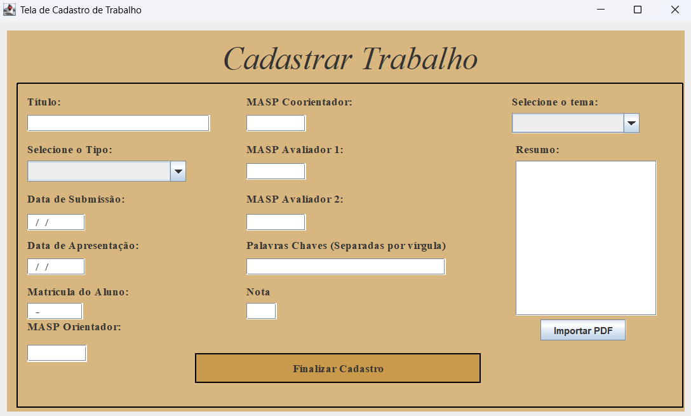

- Cadastro completo do trabalho:
  - Título;
  - Tipo (TCC, relatório, projeto etc.);
  - Datas de submissão e de apresentação;
  - Matrícula do aluno;
  - MASP de orientador, coorientador e avaliadores;
  - Tema;
  - Palavras-chave;
  - Nota;
  - Resumo.
- Botão **Importar PDF** associa o arquivo do trabalho ao registro;
- Botão **Finalizar Cadastro** salva o trabalho no repositório.

---

### 5. Tela de Busca

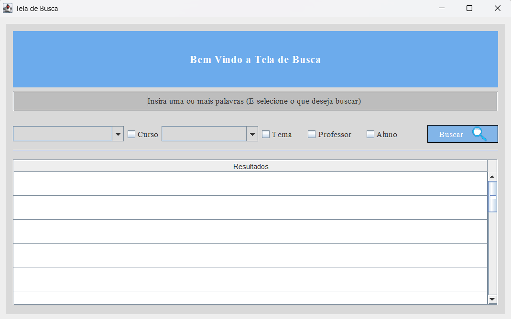

- Campo principal para inserir uma ou mais palavras-chave;
- Filtros opcionais por:
  - **Curso**,
  - **Tema**,
  - **Professor**,
  - **Aluno**;
- Os resultados são listados em uma tabela na parte inferior, permitindo selecionar um trabalho ou perfil de usuário para visualizar seus detalhes.

---

### 6. Tela de Trabalho

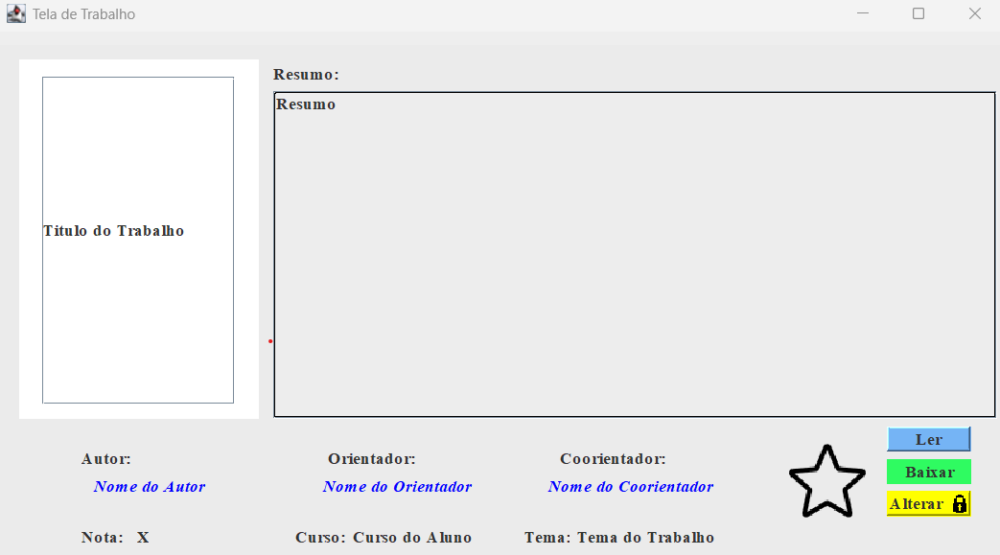

- Exibe:
  - área reservada para a capa / miniatura do trabalho;
  - **Resumo** em destaque;
  - informações de autor, orientador, coorientador, curso, tema e nota.
- Ações disponíveis:
  - **Ler** – abre o PDF associado ao trabalho;
  - **Baixar** – faz o download local do arquivo;
  - **Alterar** – disponível apenas para perfis autorizados, permitindo edição dos metadados do trabalho.

---

Confira o projeto por completo no link: (https://github.com/user-attachments/files/24038133/TCC_Eduardo_Fernandes_Final.pdf)
